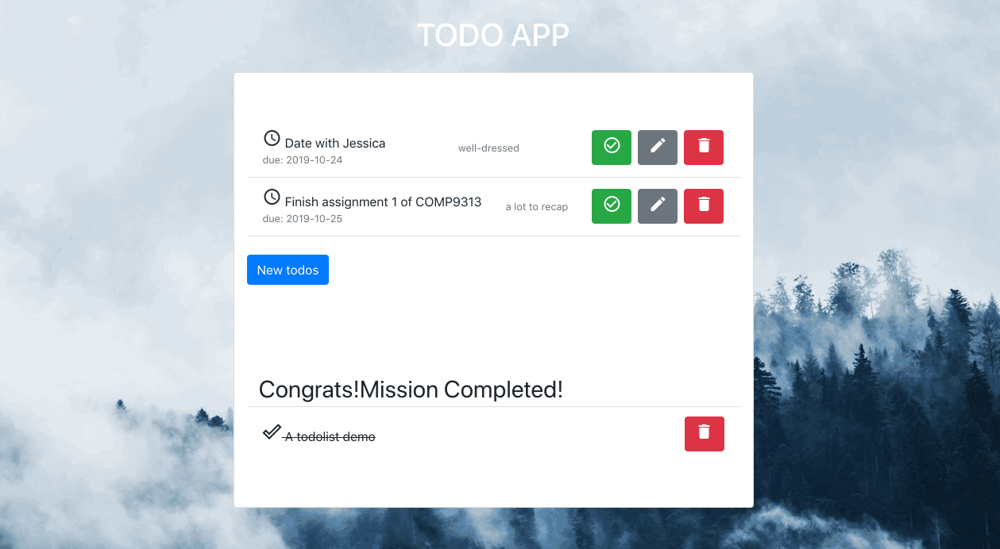
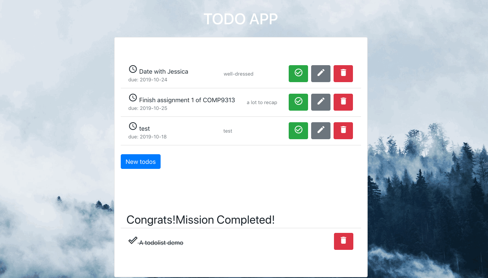
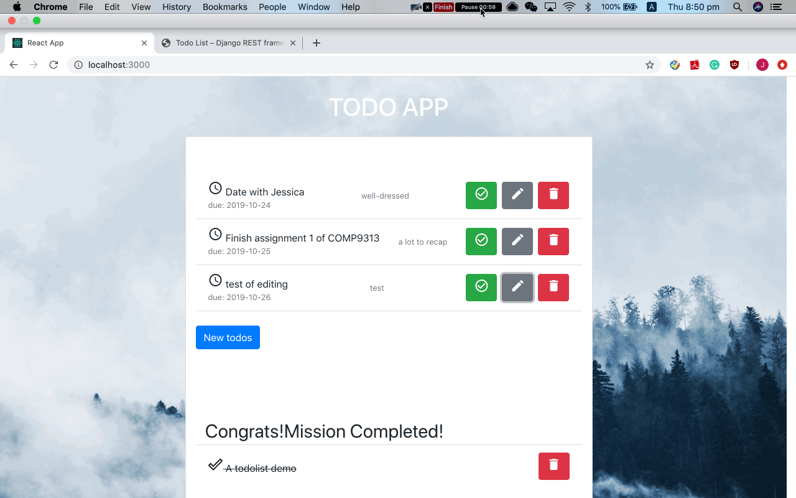
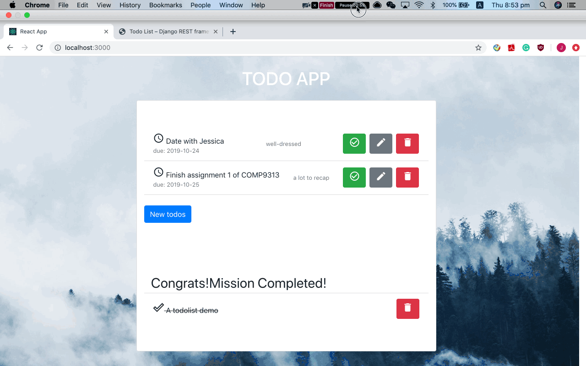
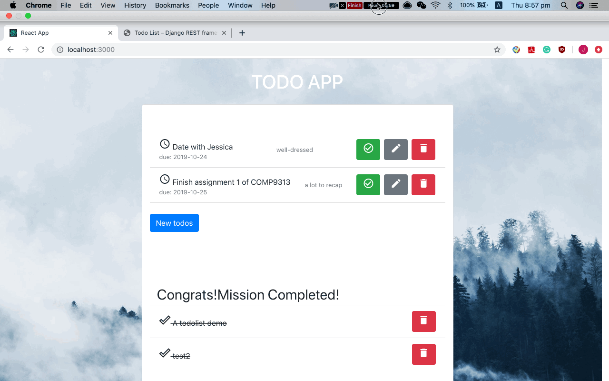
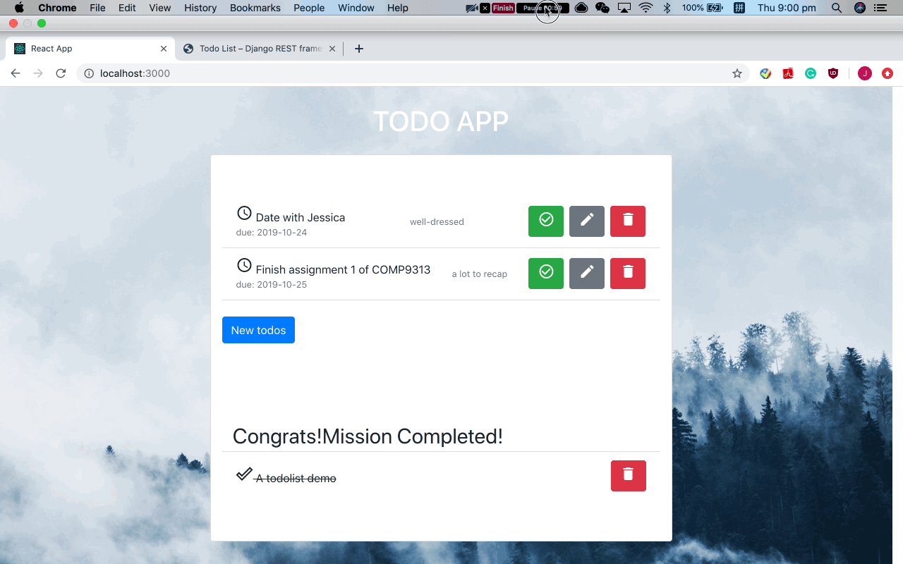
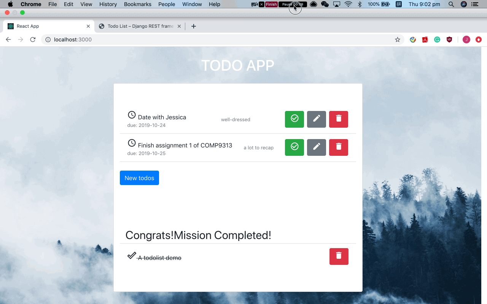

# TODOLIST Web Application

## Description

- A task manage web application with React frontend and Django backend
- Using Django REST framework api to achieve the communication between frontend and backend

## Completed all functions

- Create a todo
  
- Modify a todo
  
- Delete a todo
  
- Tag a done todo
  
- Delete a done todo
  
- List all todos/done todos
  
- Modify the deadline
  

## Run the application locally

- follow [`HowToRun.md`](./HowToRun.md)

## Techniques

- frontend
  - React
  - Bootstrap
- backend
  - Django
  - PostgreSQL
  - psycopg2 -> adapter
- communication
  - Django REST framework -> API
  - CORS

## Reference

### Backend

- [Env Setup](https://gist.github.com/harisibrahimkv/8279101)
- [Tutorial: Django REST with React (Django 2.0 and a sprinkle of testing)](https://www.valentinog.com/blog/drf/)
- [Modern Django — Part 2: REST APIs, Apps, and Django REST Framework](https://medium.com/@djstein/modern-django-part-2-rest-apis-apps-and-django-rest-framework-ea0cac5ab104)
- [Django REST framework doc](https://www.django-rest-framework.org/)
- [Django Rest Framework with React Tutorial](https://wsvincent.com/django-rest-framework-react-tutorial/)
- [Django REST framework--quickstart](https://www.django-rest-framework.org/tutorial/quickstart/)

### Frontend

- [React doc](https://reactjs.org/docs/hello-world.html)
- [React Tutorial: Call & Consume a JSON REST API with Axios](https://www.techiediaries.com/react-axios/)
- [Django and React Tutorial](https://www.youtube.com/watch?v=uZgRbnIsgrA)
- [Axios in React — Bring Your Data to the Front](https://programmingwithmosh.com/javascript/axios-in-react-bring-your-data-to-the-front/)
- [reactdj](http://srplabs.in/home)
- [axios](https://github.com/axios/axios)
- [React Icons Gets You Access to Hundreds of Open Source Icons](https://alligator.io/react/react-icons-open-source-icons/)
